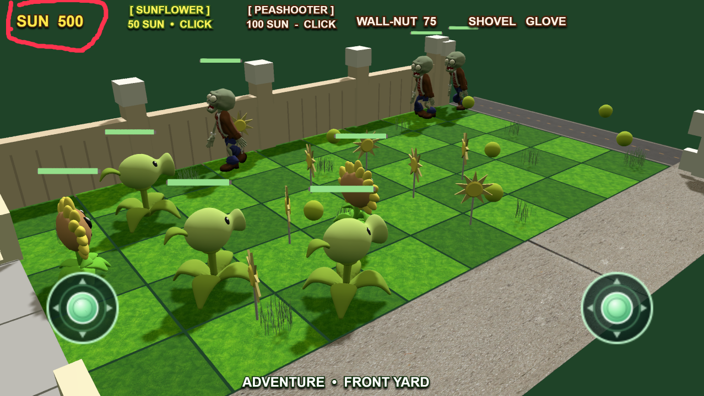

# Game issue report

- Created: 2026-08-14T00:42:49.070Z
- Project: Hero Line: Celestial Bastion
- Scene: PVZ Battle
- Preview debugger ID: preview-ws-1

## User description

the sun didnt decrease when planting plants

## Annotated screenshot

## Runtime game memory dump

[Open the game-memory dump](dumps/issue-20260814-004249-070-game-memory-dump.json)

### AI investigation guidance

Start with the user description and annotated screenshot. Only read the linked game-memory dump if the reported issue is very difficult to investigate or those sources are insufficient. Otherwise, do not read it, to avoid wasting context tokens.
