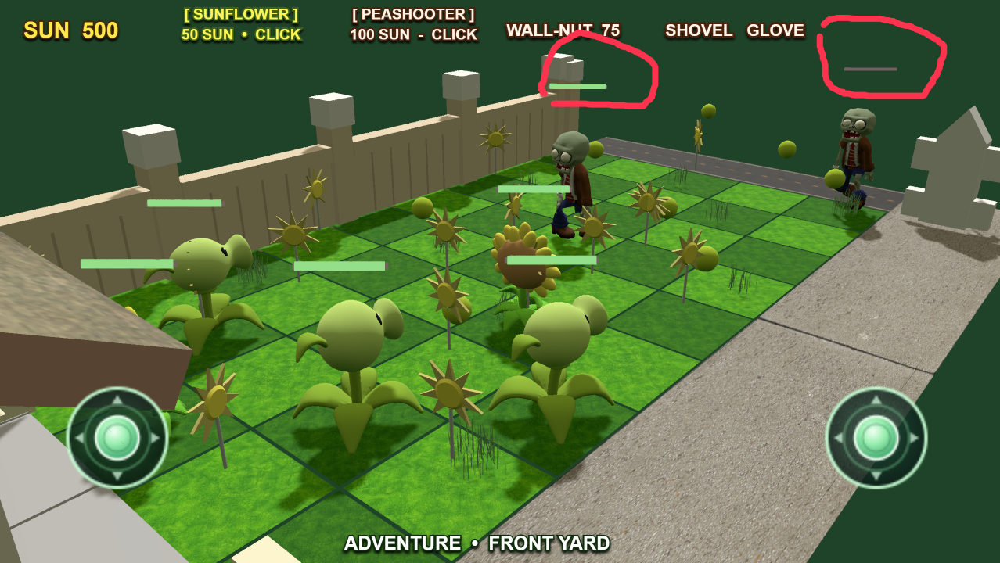

# Game issue report

- Created: 2026-08-14T00:45:21.112Z
- Project: Hero Line: Celestial Bastion
- Scene: PVZ Battle
- Preview debugger ID: preview-ws-1

## User description

the healthbar didnt decrease shorter when getting hurt , it just turn from green to gray and then destoryed , what i expected is : 1. the healthbar should be red color  2. when getting hurt , the 'progress' of the healthbar moves.

## Annotated screenshot

## Runtime game memory dump

[Open the game-memory dump](dumps/issue-20260814-004521-112-game-memory-dump.json)

### AI investigation guidance

Start with the user description and annotated screenshot. Only read the linked game-memory dump if the reported issue is very difficult to investigate or those sources are insufficient. Otherwise, do not read it, to avoid wasting context tokens.
